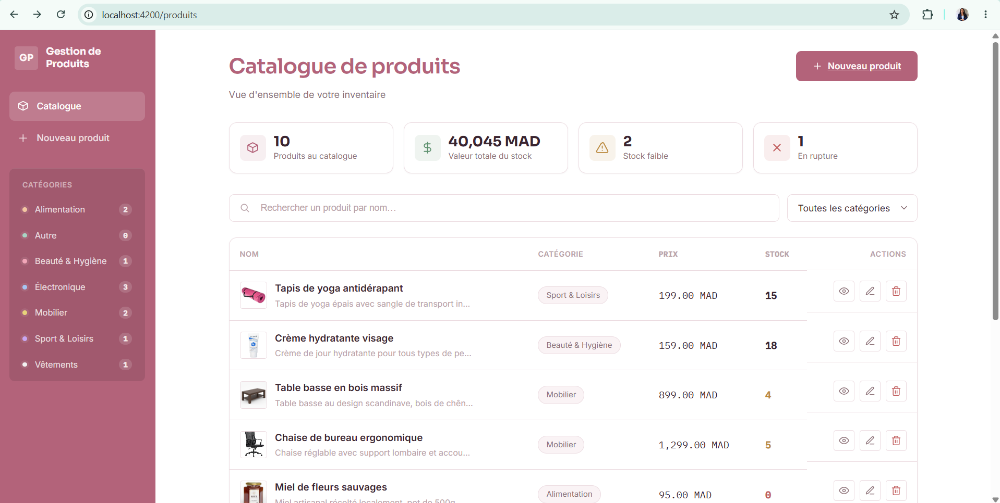
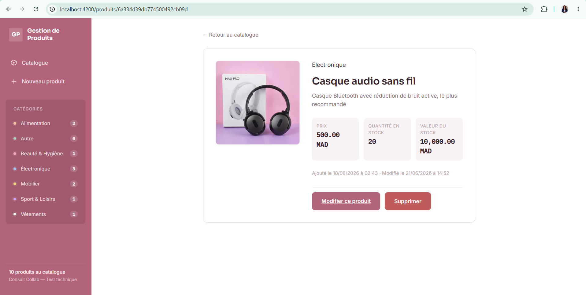
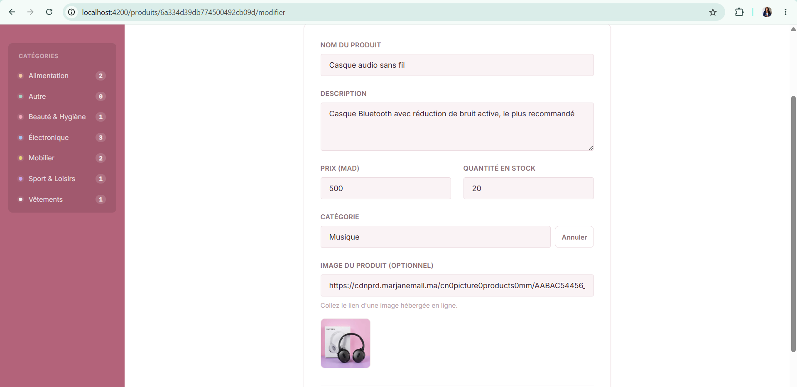
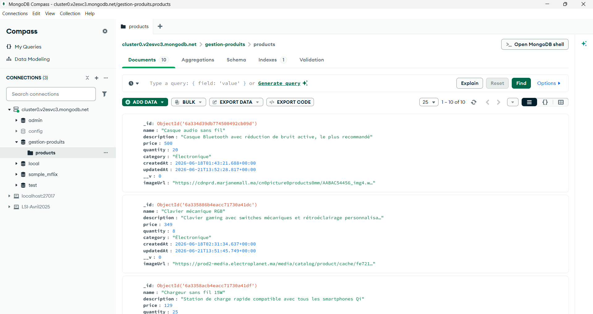

# Gestion de Produits

Mini-application web de gestion de produits réalisée dans le cadre d'un test technique. Elle permet de créer, consulter, modifier et supprimer des produits (CRUD complet) via une interface Angular connectée à une API REST Express, elle-même reliée à une base de données MongoDB.

## Stack technique

| Couche | Technologie |
|---|---|
| Frontend | Angular 21 (standalone components, signals) |
| Backend | Node.js + Express.js |
| Base de données | MongoDB (MongoDB Atlas), visualisable avec MongoDB Compass |
| Styles | SCSS |

## Architecture du projet

```
gestion-produits/
├── backend/                   # API REST Express
│   └── src/
│       ├── config/            # Connexion à la base de données
│       ├── models/            # Schémas Mongoose
│       ├── controllers/       # Logique métier des routes
│       ├── routes/            # Définition des endpoints
│       ├── middlewares/       # Gestion des erreurs et des routes 404
│       ├── app.js             # Configuration de l'application Express
│       └── server.js          # Point d'entrée du serveur
│
└── frontend/                  # Application Angular
    └── src/app/
        ├── core/
        │   ├── models/         # Interfaces TypeScript (Product)
        │   └── services/       # Services HTTP et notifications
        ├── features/
        │   └── products/
        │       ├── product-list/     # Page catalogue (recherche, filtre, suppression)
        │       ├── product-detail/   # Page de détail en lecture seule d'un produit
        │       └── product-form/     # Formulaire de création / édition
        └── shared/
            └── components/     # Composants réutilisables (toast, confirmation)
```

Le backend suit une architecture en couches (modèle / contrôleur / route) avec une gestion d'erreurs centralisée. Le frontend est organisé par fonctionnalités (`features`), avec un dossier `core` pour la logique transverse et `shared` pour les composants réutilisables.

## Fonctionnalités

- Liste des produits avec recherche par nom et filtre par catégorie
- Page de détail dédiée pour chaque produit (`/produits/:id`)
- Création d'un produit via un formulaire validé, avec image (URL) optionnelle
- Catégories dynamiques : choix parmi les catégories existantes ou création d'une nouvelle catégorie à la volée
- Modification d'un produit existant
- Suppression d'un produit avec confirmation préalable (pour éviter les erreurs)
- Indicateur visuel de stock faible ou épuisé, avec cartes de synthèse en haut du catalogue
- Sidebar de navigation avec raccourcis par catégorie et compteur de produits
- Notifications de succès / erreur après chaque action
- Interface entièrement responsive

## Aperçu

### Catalogue de produits


### Détail d'un produit


### Formulaire de création / édition


### Données dans MongoDB Compass


## Prérequis

- [Node.js](https://nodejs.org/) (version 20 ou supérieure recommandée)
- Un compte [MongoDB Atlas](https://www.mongodb.com/cloud/atlas/register) (gratuit) ou une instance MongoDB locale
- [MongoDB Compass](https://www.mongodb.com/try/download/compass) pour visualiser les données (optionnel mais recommandé)
- [Angular CLI](https://angular.dev/tools/cli) installé globalement : `npm install -g @angular/cli`

## Installation et exécution

### 1. Cloner le dépôt

```bash
git clone https://github.com/Lorraine301/gestion-produits.git
cd gestion-produits
```

### 2. Configurer et lancer le backend

```bash
cd backend
npm install
```

Créer un fichier `.env` à la racine du dossier `backend` (vous pouvez copier `.env.example`) :

```bash
cp .env.example .env
```

Puis renseigner vos propres valeurs dans `.env` :

```
PORT=5000
MONGODB_URI=mongodb+srv://<utilisateur>:<mot_de_passe>@<cluster>.mongodb.net/gestion-produits?retryWrites=true&w=majority
CLIENT_URL=http://localhost:4200
```

Démarrer le serveur :

```bash
npm run dev
```

L'API est accessible sur `http://localhost:5000`. Vous pouvez vérifier qu'elle fonctionne en ouvrant `http://localhost:5000` dans un navigateur : un message JSON de confirmation doit s'afficher.

### 3. Configurer et lancer le frontend

Dans un nouveau terminal :

```bash
cd frontend
npm install
ng serve
```

L'application est accessible sur `http://localhost:4200`.

### 4. Visualiser les données avec MongoDB Compass

Dans Compass, créer une nouvelle connexion en utilisant la même chaîne de connexion que dans votre fichier `.env` (`MONGODB_URI`). Une fois connecté, la base `gestion-produits` et sa collection `products` apparaissent automatiquement dès qu'un premier produit est créé depuis l'application.

## API — Endpoints disponibles

| Méthode | Endpoint | Description |
|---|---|---|
| GET | `/api/products` | Récupérer tous les produits |
| GET | `/api/products/categories` | Récupérer la liste des catégories distinctes déjà utilisées |
| GET | `/api/products/:id` | Récupérer un produit par son id |
| POST | `/api/products` | Créer un nouveau produit |
| PUT | `/api/products/:id` | Modifier un produit existant |
| DELETE | `/api/products/:id` | Supprimer un produit |

### Format d'un produit

```json
{
  "name": "Casque audio sans fil",
  "description": "Casque Bluetooth avec réduction de bruit active",
  "price": 499.90,
  "quantity": 12,
  "category": "Électronique",
  "imageUrl": "https://exemple.com/image.jpg"
}
```

La catégorie est une chaîne libre : quelques catégories sont proposées par défaut dans le formulaire (`Électronique`, `Vêtements`, `Alimentation`, `Mobilier`, `Beauté & Hygiène`, `Sport & Loisirs`, `Autre`), mais l'utilisateur peut en créer de nouvelles directement depuis le formulaire via l'option « + Ajouter une nouvelle catégorie ». Le champ `imageUrl` est optionnel.

## Choix techniques

### Pourquoi des standalone components plutôt que des NgModule ?

Depuis Angular 14, et de façon encore plus marquée à partir d'Angular 17+ (le `ng new` par défaut), l'écosystème s'oriente vers les **standalone components** : chaque composant déclare lui-même les modules ou composants dont il a besoin (`imports: [...]` dans le décorateur `@Component`), au lieu de dépendre d'un `NgModule` central qui regroupe tout. C'est aujourd'hui l'approche que l'équipe Angular recommande officiellement pour tout nouveau projet.

Les bénéfices concrets sur ce projet :
- **Moins de fichiers de configuration** à maintenir (pas de `app.module.ts`, `products.module.ts`, etc.)
- **Dépendances explicites** : en ouvrant `product-list.ts`, on voit immédiatement de quoi ce composant a besoin (`CommonModule`, `FormsModule`, `RouterLink`...) sans devoir remonter jusqu'à un module parent
- **Meilleur tree-shaking** : le bundler peut éliminer plus facilement le code non utilisé, puisque les dépendances sont déclarées au plus près de leur usage

### Pourquoi les Signals plutôt que NgRx ou des BehaviorSubject ?

La gestion d'état de cette application repose sur les **Signals Angular** (`signal()`, `computed()`), introduits comme solution stable depuis Angular 17 et désormais recommandés par l'équipe Angular pour la majorité des cas d'usage applicatifs.

Concrètement ici : `ProductService` expose un signal `products`, mis à jour automatiquement après chaque opération CRUD (`tap()` dans les appels HTTP) ; les composants n'ont qu'à lire ce signal pour rester synchronisés, sans code de souscription/désinscription à gérer manuellement.

Ce choix a été préféré à une librairie de gestion d'état type **Redux / NgRx** (avec actions, reducers, effects, selectors et store centralisé) pour une raison de proportionnalité : NgRx apporte une vraie valeur sur des applications avec un état partagé complexe entre de nombreuses features distantes les unes des autres. Ici, l'application ne gère qu'une seule entité (les produits), avec un flux de données simple et localisé. Ajouter NgRx aurait multiplié le nombre de fichiers et la complexité du code sans bénéfice réel, ce qui serait allé à l'encontre du critère d'évaluation « optimisation et factorisation du code ». Les Signals offrent ici la réactivité nécessaire avec beaucoup moins de code et une courbe d'apprentissage plus douce.

### Pourquoi une architecture par fonctionnalités (`features/`) ?

Plutôt que de regrouper tous les composants dans un seul dossier, le frontend suit une organisation par domaine métier : tout ce qui concerne les produits vit dans `features/products/` (liste, détail, formulaire), tandis que `core/` regroupe la logique transverse (modèles, services HTTP) et `shared/` les composants génériques réutilisables ailleurs (toast, boîte de confirmation). Cette structure facilite l'ajout futur d'autres entités métier (par exemple une gestion des commandes ou des fournisseurs) sans toucher au code existant.

### Pourquoi une validation à deux niveaux ?

Les données sont validées à la fois côté frontend (formulaire réactif Angular avec `Validators`) pour un retour immédiat à l'utilisateur, et côté backend (schéma Mongoose) pour garantir l'intégrité des données même en cas d'appel direct à l'API (par exemple via Postman ou un autre client), sans dépendre de l'interface pour assurer la cohérence des données stockées.

### Pourquoi une gestion d'erreurs centralisée côté backend ?

Un middleware Express unique (`errorHandler.js`) intercepte toutes les erreurs de l'application (erreurs de validation Mongoose, identifiants MongoDB mal formés, routes inconnues) et les transforme en réponses JSON cohérentes. Cela évite de dupliquer la logique de gestion d'erreurs dans chaque contrôleur, et garantit que le frontend reçoit toujours un format de réponse prévisible.

### Pourquoi des catégories dynamiques plutôt qu'une liste fixe ?

Le modèle de données ne contraint plus la catégorie à une liste fermée (enum) : le backend expose un endpoint dédié (`GET /api/products/categories`) qui retourne les catégories réellement utilisées en base. Le formulaire propose des catégories par défaut tout en permettant à l'utilisateur d'en créer de nouvelles à la volée, ce qui rend le catalogue évolutif sans nécessiter de modification du code pour ajouter une nouvelle catégorie de produits.

## Auteur

<<<<<<< HEAD
Andriamasy Lorraine Agnès RAHELIARISOA — Étudiante en cycle ingénieur, filière Génie Logiciel et Systèmes Intelligents (FST Tanger)
=======
Andriamasy Lorraine Agnès RAHELIARISOA — Étudiante en cycle ingénieur, filière Logiciels et Systèmes Intelligents (FST Tanger)
>>>>>>> ccc61a406dec9fc1d3a837f72d48da89e13a5e56
